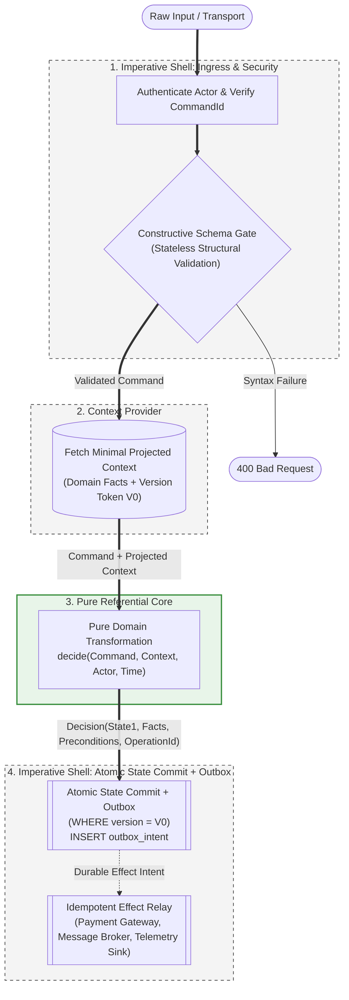

<div align="center">

# Schema-Driven Dataflow Architecture (SDDA)

**An architectural standard optimized for autonomous code acquisition, synthesis, and verification.**  
*Replacing implicit state machines and layered indirection with explicit data pipelines, referentially transparent domain cores, and idempotent egress.*

[](spec.md)
[](LICENSE)
[](spec.md)

</div>

---

> *"The best racing drivers have **mechanical sympathy**—an instinctive understanding of how the machine works, allowing them to extract maximum performance without destroying it."*  
> — **Jackie Stewart**

In high-performance computing, **mechanical sympathy** aligns software with hardware caches, memory hierarchies, and branch predictors.

In the era of autonomous software engineering, **machine operability** requires aligning codebases with the operational constraints of coding agents: context-window budgets, repository retrieval locality, deterministic compiler feedback, and mock-minimized verification loops.

**SDDA is software architecture designed for systems where the primary author, editor, and tester is increasingly an autonomous agent.**

---

## 1. The Core Problem: Implicit State Machines & Repository Indirection

Modern enterprise architectures (layered Clean Architecture, heavy Domain-Driven Design, and deep inheritance hierarchies) evolved to help human teams organize code around intuitive, real-world metaphors:

```text
Enterprise OOP (Implicit Distributed State Machine):
Object ──► Injected Service ──► Abstract Factory ──► Dynamic Dispatch ──► Mutable State ──► Callback
```

While effective for human mental chunking, recent empirical research into repository-level coding agents demonstrates that this structural indirection triggers severe agent failure modes:

* **Context Acquisition Failure:** In repository-level code navigation, modern coding agents frequently fail to locate the files required for a task. Evaluations on **Agent Retrieval Bench** (Qin & Xie, 2026) show that logged agent exploration trajectories miss every relevant source file in **27–35%** of evaluated retrieval cases.
* **Context Bloat vs. Synthesis Degradation:** Research from **ETH Zurich's SRI Lab** (2026) demonstrates that adding expansive repository-level context files increases agent inference costs by **over 20%** on average without improving task success rates. Agents achieve higher accuracy with narrow, targeted, and structurally constrained context.
* **The Mock Hallucination Trap:** In enterprise OOP, unit tests require mocking injected dependencies, service containers, and asynchronous lifecycles. Autonomous repair loops frequently collapse when agents hallucinate mock configurations rather than repairing domain logic.

---

## 2. The Solution: Explicit Typed State Transitions

SDDA does not eliminate state machines—it makes them **explicit**. It replaces implicit, object-bound state machines with a deterministic transition pipeline:

```text
SDDA (Explicit Typed State Transition):
Raw Input ──► Schema Gate ──► Projected Context ──► Pure Decision ──► Atomic State Commit + Outbox
```

$$\text{State}_0 + \text{Command} \xrightarrow{\text{Pure Core}} \text{Decision}(\text{State}_1, \text{DomainFacts}) \xrightarrow{\text{Idempotent Shell}} \text{Atomic State Commit} + \text{Durable Effect Intent}$$

At every step, the next code block an agent must generate or inspect is strictly bound by **visible input schemas**, **narrow projected context**, and **algebraic output types**—collapsing search space and maximizing repository locality.

---

## 3. The Agent Ergonomics Hypothesis

SDDA is grounded on an explicitly testable software engineering proposition:

> **The Agent Ergonomics Hypothesis:**  
> In codebases where autonomous AI agents perform feature additions, refactoring, and bug fixes, architectures that enforce **zero-indirection dataflow**, **referentially transparent domain logic**, **narrow context projections**, and **machine-checkable schema boundaries** will achieve:
> 
> 1. **Operational Efficiency (H1):** Lower multi-file retrieval failure rates, fewer failed repair iterations, and lower inference token expenditure per task compared to deep object-oriented class hierarchies.
> 2. **Longitudinal Architectural Stability (H2):** Bounded architectural drift over 50–100 consecutive unassisted maintenance tasks, preventing the progressive degradation of boundaries, leaked I/O, and ad-hoc abstractions typical of unconstrained agent edits.
> 3. **Mechanical Constraint Convergence (H3):** Autonomous self-repair back to valid architectural boundaries driven deterministically by AST linter errors in CI, without human intervention or custom prompt tuning.
>
> *For the formal experimental design, null hypotheses ($H_0$), and metric definitions, see [**`BENCHMARK.md`**](BENCHMARK.md).*

---

## 4. The 8 Hard Invariants of SDDA

1. **Explicitness over Implicitness (No Hidden Dependencies):** All configurations, reference data, tenant identifiers, timestamps, and authenticated actor facts must arrive via explicit function arguments. Zero ambient singletons, zero service locators, zero hidden system clocks.
2. **Immutability of Domain Values:** State transitions yield new values; in-place memory mutation across boundaries is prohibited. Pure methods on immutable value objects (e.g., `money.add(tax)`) are permitted; hidden internal state mutation is banned.
3. **Zero I/O in the Referential Domain Core:** The business core is strictly referentially transparent ($f(\text{data}) \to \text{data}$). It contains no database queries, network requests, filesystem access, or direct logger invocations.
4. **Data as Architectural Units, Functions as Behavioral Units:** Systems are organized around explicit schemas and their sequential transformations, not around stateful manager classes.
5. **Coarse-Grained Progressive Type Lineage:** Distinct types are introduced only when crossing meaningful trust, semantic, or architectural boundaries (`RawPayload` $\to$ `ValidatedCommand` $\to$ `DomainDecision`). Micro-type proliferation is prohibited.
6. **Formally Disentangled Effect Identities:** Systems must formally separate `CommandId` (ingress deduplication), `ExpectedVersion` (concurrency token), and `OperationId` (durable effect identity) to guarantee safe, idempotent execution.
7. **Domain Facts ≠ Infrastructure Telemetry:** The Core emits passive domain facts and events. The Imperative Shell maps these facts into infrastructure telemetry (spans, metrics, structured log events).
8. **Decide in the Core, Atomically Commit in the Shell:** Business rules evaluate to an algebraic decision. The Imperative Shell executes an **Atomic State Commit + Durable Effect Intent** under Optimistic Concurrency Control (OCC) and records outbox records within a single transactional datastore operation.

---

## 5. System Topology: Strata & Boundaries

SDDA organizes execution into distinct architectural strata, cleanly separating transport, security, validation, business logic, and durable side effects:



---

## 6. Production Architectural Mechanisms

### Two-Tier Validation Boundary
* **Tier 1: Structural Parsing (Schema Gate):** Pure, stateless parsing over raw payload tokens (type checks, pattern constraints, length limits). Zero external I/O.
* **Tier 2: Invariant Evaluation (Domain Core):** Pure evaluation of validated commands against explicitly fetched context (balance checks, resource allocation limits, business policies).

### Minimal Context Projection (Epistemic Boundary)
Domain functions must never accept entire database entity models. The Ingress Shell projects datastore records into the **minimal epistemic slice** required for the decision. 

```text
// Anti-Pattern: Leaks database infrastructure and broad entity state
decide(cmd: ReservationCommand, hotel: HotelEntity, dbUser: UserEntity)

// Canonical SDDA: Minimal epistemic requirement
decide(cmd: ReservationCommand, ctx: ReservationContext)
```
This isolates the domain contract, eliminates multi-table datastore over-fetching, and bounds the context surface an agent must read.

### Formal Identity & Idempotency Model
To guarantee exactly-once side-effect semantics in distributed environments, SDDA formally distinguishes four identity tokens:

1. **`CommandId` (Ingress Deduplication):** Identifies the incoming request (e.g., HTTP idempotency key). Verified at the Ingress Shell to prevent duplicate command processing.
2. **`AggregateId` & `ExpectedVersion` (Concurrency Precondition):** Identifies the target entity and its version token ($V_0$). Enforces Optimistic Concurrency Control (OCC) during state commit.
3. **`OperationId` (Durable Effect Identity):** A deterministic or unique token generated for each outbound side effect (e.g., payment charge, external dispatch). Persisted alongside state updates in the outbox.
4. **Downstream Idempotency Token:** The outbox relay passes the `OperationId` as an idempotency key to external providers, ensuring that at-least-once outbox relay mechanisms produce exactly-once side effects.

### Replayable Core + Idempotent Egress
The Core is referentially transparent and safe to recompute. However, real-world external side effects cannot simply be repeated.
* State writes enforce **Optimistic Concurrency Control (OCC)**: `WHERE id = ? AND version = V0`.
* External effects carry a durable **`OperationId`** derived from the command identity.
* If an OCC conflict occurs, the Shell executes a **bounded retry policy**: refetch versioned state, recompute the pure decision, and submit the effect under its stable idempotency key.

### Stepwise Workflows (Conditional I/O)
When downstream data fetching depends on intermediate business decisions, workflows are modeled as **Typed State Transition Graphs**:

```text
Decision = 
    | TerminalDecision { action, state_delta, preconditions }
    | NeedsContext     { required_query, continuation_token }
```
The Core returns `NeedsContext` instead of performing I/O. The Shell resolves the required data from external services and invokes the next pure step, eliminating greedy upfront over-fetching.

### Observability as Data
Core functions must not invoke active logging clients or tracing agents. If diagnostic tracking is needed, the Core returns domain events and metric facts **as passive data records** within the `DomainDecision`. The Egress Shell sinks them into metrics backends, distributed tracing collectors, or structured log streams.

---

## 7. Polyglot Language Guidance (Top 10+ Ecosystems)

SDDA maps across diverse programming languages based on value semantics, pattern matching, and schema boundary parsing:

| Language Family | Core Architectural Primitives | Classification | Implementation Contract |
| :--- | :--- | :--- | :--- |
| **Rust** | `enum`, `struct`, `match`, immutable by default, `Result<T, E>`, Serde. | **Native SDDA** | Idiomatic first-class fit; compile-time exhaustiveness guarantees zero unhandled decision variants. |
| **Swift / Kotlin** | Swift `enum` with associated values, `struct`, `Codable`; Kotlin `sealed interface`, `data class`. | **Native SDDA** | Native algebraic data types with strict compiler exhaustiveness and value-type semantics. |
| **TypeScript / JavaScript** | Discriminated union types (`type T = A \| B`), structural typing, runtime schema parsers. | **Pragmatic Structural** | Natural ergonomics for coding agents; runtime schema libraries are mandatory to replace erased compile-time types. |
| **Java (21+)** | `sealed interface`, `record`, pattern-matching `switch`. | **First-Class Enterprise** | Replaces verbose class hierarchies with immutable data records and compiler-checked decision branches. |
| **C# (10+)** | Positional `record`, record structs, algebraic pattern matching (`switch` expressions). | **First-Class Enterprise** | Strong value semantics and concise syntax for dataflow pipelines and decision branches. |
| **Python (3.10+)** | `dataclass(frozen=True)`, `typing.Union`, `Literal`, structural pattern matching (`match/case`), Pydantic. | **Strong Ecosystem Fit** | Highly familiar to coding agents; static analyzers are recommended to verify pattern exhaustiveness. |
| **Modern C++ (17/20/23)** | `std::variant`, `std::visit`, `constexpr`, frozen structs, value semantics. | **Native ADT Systems** | Excellent type-state modeling; requires strict team/linter discipline to prevent reference leaks and hidden state. |
| **PHP (8.1+)** | `readonly class`, `enum` (backed & pure), `match` expressions, structured data mappers. | **Adapted Modern Dynamic** | Enforce immutability via `readonly` classes; emulate sum types with typed class hierarchies handled via strict `match` expressions. |
| **Go** | `struct`, interface with unexported type-marker methods, type switches (`switch v := d.(type)`). | **Standardized Adapter Profile** | Simplicity and low indirection fit agent synthesis; tagged unions are mapped via standardized struct discriminators. |
| **Ruby (3.x)** | `Data.define`, pattern matching (`case/in`), strict schema parsing libraries. | **Adapted Dynamic Profile** | Leverage immutable `Data` records and pattern matching; boundary schema contracts must be strictly enforced at runtime. |

---

## 8. The Pragmatic Boundary: Prohibiting Hidden State, Not Syntax

SDDA does not ban object-oriented syntax; it prohibits **hidden state and implicit side effects**:

* **Permitted in the Imperative Shell:** Stateful connection pools, socket listeners, transactional datastore clients, cache connections, and object store drivers (`DatabaseConnectionPool`, `CacheClient`, `ObjectStoreClient`) benefit from runtime encapsulation.
* **Permitted in the Referential Core:** Pure, immutable value objects whose methods yield new values without modifying internal state or invoking external dependencies (e.g., `money.add(tax) -> Money`).
* **Prohibited in the Referential Core:** Mutable object fields, injected service containers, dynamic dispatch hierarchies, ambient clocks, and direct side-effect execution.

---

## 9. Mock-Minimized Verification Strategy

SDDA establishes a tiered testing model that drastically simplifies verification loops for autonomous agents:

```text
┌────────────────────────────────────────────────────────┐
│ DOMAIN CORE: Pure Matrix & Property Tests (Zero Mocks) │
│ Inputs: Data Fixtures ──► Outputs: Algebraic Assertions│
└────────────────────────────────────────────────────────┘
                            ▲
                            │ Wrapped by
┌────────────────────────────────────────────────────────┐
│ IMPERATIVE SHELL: Integration & Contract Tests         │
│ Verify OCC conflicts, outbox relays, and serialization │
└────────────────────────────────────────────────────────┘
```

Because the business core has zero I/O, agents verify edge cases using **Table-Driven / Parameterized Matrices**:

```text
TEST MATRIX: Reservation Decision Rules
┌──────────────┬──────────────────┬──────────────┬────────────────────────────┐
│ Guests (Cmd) │ Available (Ctx)  │ Rate (Ctx)   │ Expected Decision Variant  │
├──────────────┼──────────────────┼──────────────┼────────────────────────────┤
│ 2            │ 5                │ 100          │ Approved(total = 200)      │
│ 6            │ 5                │ 100          │ Rejected(CapacityExceeded) │
│ 2            │ 0                │ 100          │ Rejected(OutOfStock)       │
│ 2            │ 5                │ 0            │ Rejected(InvalidRate)      │
└──────────────┴──────────────────┴──────────────┴────────────────────────────┘
```

This format eliminates hallucinated mock frameworks, minimizes output token consumption during test synthesis, and provides unambiguous regression signals.

---

## 10. Disentangling the Benefits

SDDA delivers distinct advantages across three separate domains:

| Dimension | Human Engineering Benefits | Autonomous Agent Benefits | Distributed Systems Benefits |
| :--- | :--- | :--- | :--- |
| **Architecture** | Clear separation of concerns; zero spaghetti state. | High repository locality; lower token burn across files. | Well-defined boundaries; explicit data ownership. |
| **Domain Logic** | Trivial unit test authoring without mocks. | Rapid test-repair loops with structured fixtures. | Fully deterministic, replayable business logic. |
| **State & I/O** | Explicit dependencies make code reviews predictable. | Predictable compiler diagnostics and type errors. | Transactional outbox prevents dual-write corruption; OCC prevents race conditions. |

---

## 11. Mechanical Enforcement & Empirical Roadmap

The definitive standard of SDDA is automated mechanical enforcement and empirical verification:

* [`spec.md`](spec.md): Complete normative specification with formal RFC 2119 clauses.
* [`BENCHMARK.md`](BENCHMARK.md): Formal scientific protocol, null hypotheses ($H_0$), and longitudinal twin experiment for architectural falsification.
* [`rules/ast-linters/`](rules/): AST rules rejecting I/O, network imports, ambient system clocks, and singleton state inside core domain directories.
* [`templates/`](templates/): Drop-in agent instruction profiles (`AGENTS.md`, editor rule templates).
* [`rfc/`](rfc/): Formal Requests for Comments—including the foundational core specification RFC, runtime conformance profiles (Go, PHP, Java), and architectural extensions (Sagas, Event Sourcing).

---

## References

1. **Qin, B., & Xie, Y. (2026).** *Agent Retrieval Bench: Evaluating Repository Context Retrieval for Coding Agents.* arXiv:2607.24882. Demonstrates that logged agent trajectories miss every gold file on 27–35% of evaluated retrieval samples across repository-level coding tasks.
2. **SRI Lab, ETH Zurich. (2026).** *Are Repository-Level Context Files Helpful for Coding Agents?* arXiv:2602.11988. Demonstrates that adding expansive repository context files increases agent inference costs by over 20% on average without improving task success rates.
3. **Bernhardt, G. (2012).** *Boundaries: Functional Core, Imperative Shell.* Architecture talk establishing the isolation of deterministic business logic from effectful execution boundaries.
4. **Sharvit, Y. (2022).** *Data-Oriented Programming: Reduce software complexity.* Manning Publications. Formalizes the separation of passive data structures from functional code.
5. **King, A. (2019).** *Parse, don't validate.* Technical treatise on constructive type narrowing at application boundaries.

---

## License

Licensed under the [Apache License, Version 2.0](LICENSE).
